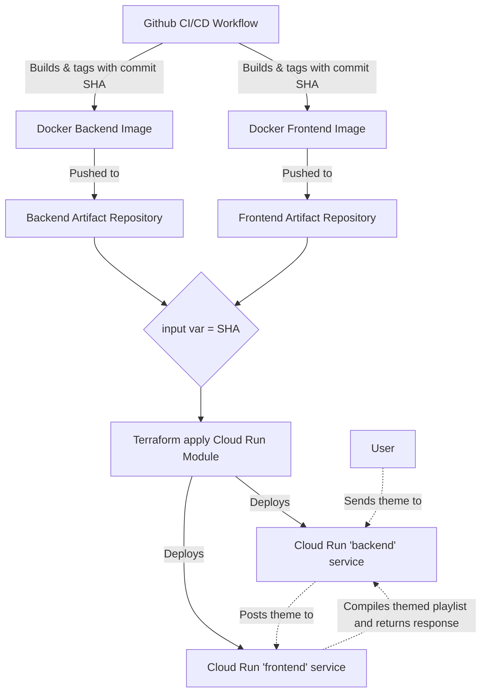

# GPTunes

This repository contains the code for the GPTunes application that allows you to generate themed playlists within a matter of seconds! To try it out, visit the following website: https://gptunes.nl/. Enjoy the music!

## General overview
GPTunes is hosted on Google Cloud Platform, where the frontend that users interact with and the backend are separately deployed as serverless Cloud Run services. The cloud resources are automatically rolled out by a CI/CD pipeline.

